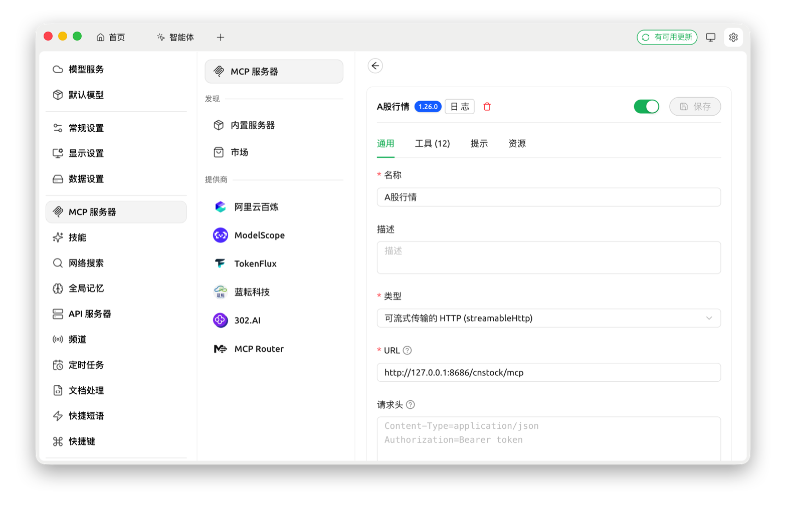

# CnStock · A 股数据 MCP 服务

给 AI Agent 用的 A 股数据服务。一次调用拿到行情、财务、资金流向和技术指标，直接交给大模型分析。

*An MCP server that gives AI agents China A-share market data — quotes, financials, capital flows and technical indicators — in a single call.*


## 特性

- 覆盖沪深京 A 股、主要指数和场内 ETF
- 个股报告：基本数据、行情、资金流、财务和技术指标，按需选 `brief`、`medium`、`full` 三档，一次最多 4 个标的
- 资金流：个股当日超大单、大单、中单、小单净流入，逐日历史和盘中实时；行业、概念、地域板块资金流排行
- K 线和技术指标：日 K 线支持前复权、后复权、不复权，内置 KDJ、MACD、RSI、布林带
- 市场数据：全市场涨跌分布、行业强弱、龙虎榜、涨停池、公告和业绩预告
- 历史查询：个股报告、K 线、技术指标和事件池都可以查某一天，如 `date=2026-06-05`
- 多源兜底：主要数据都有多个来源（东方财富、腾讯、新浪、同花顺），一个取不到自动换下一个；最终没取到的会在报告里写明，不用 0 或旧数据冒充
- 标准接入：支持 Streamable HTTP、SSE、stdio，输出 Markdown 报告或严格 JSON
- 免账号、免密钥，开箱即用，自带 `health` 工具查看服务可用率

## 工具一览

| 分类 | 工具 | 用途 |
| --- | --- | --- |
| 个股报告 | `brief` | 基本数据、行情、当日资金流 |
| | `medium` | 在 `brief` 基础上增加财务摘要 |
| | `full` | 在 `medium` 基础上增加完整财务、历史资金流和技术分析 |
| K 线与指标 | `kline_daily` | 指定交易日的日 K 线，支持前复权、后复权、不复权 |
| | `kline_range` | 指定区间的日 K 线 |
| | `tech` | OHLCV 以及 KDJ、MACD、RSI、布林带，返回严格 JSON |
| 市场与板块 | `sector_fund_flow` | 行业、概念、地域板块的资金流排行，可看当日、5 日、10 日 |
| | `market_map` | 各行业资金流入流出和行业内个股强弱，可按市场筛选 |
| | `market_breadth` | 全市场涨跌家数、涨跌停家数和涨跌幅十档分布 |
| | `market_events` | 指定日期的龙虎榜、涨停池、炸板池、公告和业绩预告 |
| 辅助 | `trading_calendar` | 某天是否交易日、前后交易日、区间内的交易日列表 |
| | `health` | 服务自身的可用率、缺失明细和耗时，只读日志，不请求上游 |

标的代码写成交易所前缀加 6 位代码，如 `SH600519`、`SZ000001`；前缀写错会自动纠正（`SH000333` 会改成 `SZ000333`）。个股报告和 `tech` 每次最多处理 4 个标的，多出的会写进 `warnings`。各工具返回的字段见[输出与错误契约](docs/technical-details.md#9-输出与错误契约)。

## 效果示例

比如问 Agent「贵州茅台最近资金面怎么样」，它会调用 `brief symbol=SH600519`，得到下面这份报告（节选）：

```text
# 基本数据

- 股票代码: SH600519
- 股票名称: 贵州茅台
- 数据日期: 2026-09-24
- 总市值: 15463.51亿
- 市盈率(静): 18.78
- 市盈率(动): 17.37
- 市净率: 6.15
- 净资产收益率: 16.75%

# 交易数据

## 价格
- 当日: 1237.000 开盘: 1250.010 最高: 1256.130 最低: 1231.050
- 20日均价: 1281.338 最高: 1338.860 最低: 1231.050

## 涨跌幅
- 当日: -1.14%
- 20日累计: -4.66%

## 资金流向
- 当日主力净流入: -5.28亿  主力净占比: -13.64%
- 当日超大单净流入: -2.63亿  超大单净占比: -6.80%
- 当日大单净流入: -2.64亿  大单净占比: -6.84%
- 当日中单净流入: 5.28亿  中单净占比: 13.65%
- 当日小单净流入: -37.32万  小单净占比: -0.01%
```

完整报告还有行业概念，5 日到 240 日的均价、涨跌幅、振幅、成交量、成交额，以及换手率。`full` 的完整样例见[兆易创新 SH603986](docs/SH603986-full.md)。

## 快速开始

需要 Python 3.12 或更高版本，支持 Linux 和 macOS，服务器推荐 Ubuntu。装了 [uv](https://docs.astral.sh/uv/) 会用 uv 安装，没有就用标准的 venv 和 pip。

```bash
git clone https://github.com/lllyin/mcp-cn-a-stock.git
cd mcp-cn-a-stock
./install.sh     # 安装 Python 依赖和 Chromium，只需执行一次
./start.sh       # 后台启动，不需要任何配置
```

启动后的 MCP 地址：

```text
http://127.0.0.1:8686/cnstock/mcp
```

验证是否可用（需要 Node.js）：

```bash
npx mcporter call "http://127.0.0.1:8686/cnstock/mcp.brief" symbol=SH600519
```

能看到和上面类似的报告就说明装好了。停止服务用 `./stop.sh`；日志在 `logs/cn-stock-mcp.log`，启动时会打印当前版本。

> Chromium 用于盘中实时资金流和 `market_breadth` 的首选数据源。没有桌面的 Ubuntu 可以再装 `xvfb`，
> 没有 `DISPLAY` 时 `start.sh` 会自动启动它；不装也不影响其他工具。

## 接入 MCP 客户端

服务使用 Streamable HTTP 传输，地址填 `http://127.0.0.1:8686/cnstock/mcp`。

**Claude Code**

```bash
claude mcp add --transport http cn-stock http://127.0.0.1:8686/cnstock/mcp
```

**Cursor 等用 JSON 配置的客户端**

```json
{
  "mcpServers": {
    "cn-stock": {
      "url": "http://127.0.0.1:8686/cnstock/mcp"
    }
  }
}
```

各客户端的字段名略有不同，有的还要求写 `"type": "streamableHttp"`，以客户端文档为准。

**Cherry Studio**：设置 → MCP 服务器，添加一个服务器，类型选「可流式传输的 HTTP（streamableHttp）」，URL 填上面的地址。保存后在「工具」页能看到 12 个工具。



DeepChat 的配置方法和使用效果见[让 DeepSeek 通过 MCP 分析股票](docs/let-your-deepseek-analyze-stock-by-mcp.md)。

> 地址请写 `127.0.0.1`，不要写 `localhost`。服务只监听 IPv4，而 macOS 上 `localhost` 会先解析到 IPv6 的
> `::1`，有的客户端被拒绝后不会改用 IPv4，表现为一直连不上也不报错。

也可以不用 `start.sh`，在前台启动并指定传输方式。只支持 stdio 的客户端，可以让它直接执行第二条命令（路径写绝对路径）。这种方式下，`start.sh` 负责的日志归档和 Xvfb 管理不会生效。

```bash
.venv/bin/python main.py --transport http --port 8686
.venv/bin/python main.py --transport sse --port 8686
.venv/bin/python main.py --transport stdio
```

## 可以这样问

接入后直接用自然语言提问，Agent 会自己选工具：

- 贵州茅台今天主力资金是流入还是流出？（`brief`）
- 对比兆易创新和北方华创近 60 日的资金流和 MACD。（`full`）
- 2026-08-20 有哪些涨停股上了龙虎榜？（`market_events`）
- 今天哪些行业在被主力买入？创业板里哪只股票最强？（`sector_fund_flow`、`market_map`）
- 6 月 5 日收盘时宁德时代的资金面怎么样？（`brief`，带 `date`）

<details>
<summary><b>用命令行调用（mcporter）</b></summary>

先注册一次服务名：

```bash
npx mcporter config add cn-stock --url http://127.0.0.1:8686/cnstock/mcp --scope home
```

个股报告，多个标的用半角逗号隔开，一次最多 4 个：

```bash
npx mcporter call cn-stock.brief symbol=SH600519
npx mcporter call cn-stock.medium symbol=SZ000333
npx mcporter call cn-stock.full symbol=SH603986 fund_flow_limit=30
npx mcporter call cn-stock.brief symbol=SH600000,SZ000333,SZ300750,SH688981
```

查历史某一天：

```bash
npx mcporter call cn-stock.brief symbol=SZ002463 date=2026-06-05
npx mcporter call cn-stock.tech symbol=SZ002463 days=30 date=2026-06-05
```

技术指标，`fields` 可以只取其中几组：

```bash
npx mcporter call cn-stock.tech symbol=SZ002463,SH688981 days=10
npx mcporter call cn-stock.tech symbol=SZ002463 fields=macd,kdj include_derived=true
```

K 线，`adjust` 可选 `qfq`（前复权，默认）、`hfq`（后复权）、`none`（不复权）：

```bash
npx mcporter call cn-stock.kline_daily symbol=SH603986 date=2026-05-29 adjust=qfq
npx mcporter call cn-stock.kline_range symbol=SH603986 start_date=2026-05-22 end_date=2026-05-29
```

市场与板块：

```bash
npx mcporter call cn-stock.market_breadth
npx mcporter call cn-stock.sector_fund_flow sector_type=concept period=5d
npx mcporter call cn-stock.market_map board=star fmt=markdown
npx mcporter call cn-stock.market_events date=2026-08-20 sources=lhb,limit_up,announcements
```

`market_map` 的 `board` 可选 `all`（全部 A 股）、`sse`（上证主板）、`star`（科创板）、`szse`（深证主板）、
`chinext`（创业板）、`bse`（北交所）。按市场筛选比 `all` 快得多，需要翻的页少。`market_events` 的 `sources`
可以组合 `lhb`、`limit_up`、`strong`、`previous_limit_up`、`broken_board`、`announcements`、`earnings_forecast`。
其余参数见各工具的说明：`npx mcporter list cn-stock`。

</details>

## 数据来源与可靠性

默认只用公开接口，不需要任何账号。主要数据都配了备用源，按下表的顺序尝试，前一个取不到就换下一个：

| 数据 | 默认来源顺序 |
| --- | --- |
| 基本数据（市值、市盈率、市净率） | 东方财富 → 腾讯 |
| 日 K 线（个股、ETF） | 东方财富 → 腾讯 → 新浪 → 同花顺 |
| 日 K 线（指数） | 东方财富 → 同花顺 → 腾讯 → 新浪 |
| 盘中实时行情 | 东方财富资金流页面 → 腾讯 → 同花顺 → 新浪 |
| 个股资金流 | 东方财富 → 东方财富备用集群 → 东方财富资金流页面（浏览器）；盘中实时数据直接取自资金流页面 |
| 财务报表 | 同花顺 → 新浪 |
| 板块资金流 | 东方财富 → 东方财富备用接口（只有主力净额） |
| 市场宽度 | 同花顺 → efinance |
| 交易日历 | 新浪（交易所公布的交易日名单）→ holiday-cn（国务院放假安排）→ 按工作日推算 |
| 龙虎榜、涨停池、公告、业绩预告 | 东方财富 |

- 最终没取到的数据，报告里会写明（例如「暂无资金流向数据」）；降级和截断的原因写在返回结果的 `warnings` 里。
- 行情和资金流都对齐到报告开头的「数据日期」。周末、节假日和开盘前，数据日期是最近一个已经收盘的交易日。
- `health` 工具从日志统计各维度的可用率、缺失明细和耗时，不请求上游，随时可以调。
- 东方财富对部分出口 IP 限流较严。资金流的来源链末尾还可以加按积分计费的付费网关（默认关闭），见[配置参考](docs/configuration.md#取数源与顺序)。

数据链路、回退和缓存的细节见[技术实现说明](docs/technical-details.md)。

## 配置

不配置就能运行。需要调整时，把 `.env.example` 复制成 `.env` 再改，改完重启服务。最常用的几项：

- `FUND_FLOW_PROVIDERS`：资金流的来源顺序，默认已包含浏览器页面兜底（`fund_flow_page`），可以在末尾加付费网关（`eastmoney_gateway`）
- `AKSHARE_PROXY_ENABLED`：付费网关的开关，默认关闭
- `CACHE_ENABLED`：缓存总开关
- `BROWSER_MAX_PAGES`：浏览器同时打开的页面数，直接决定峰值内存
- `ENV_PREFIX`：和别的程序共用环境变量时，给所有配置名加上前缀

全部配置项、默认值和取值方法见[配置参考](docs/configuration.md)。

## 常见问题

**数据日期为什么不是今天？**

非交易日和开盘前，返回的是最近一个交易日的数据，行情和资金流都对齐到这一天。指定日期查询时，
如果那天不是交易日，会用那天之前最近的交易日。代码写错或标的尚未上市时，可能返回空结果。

**第一次调用比较慢**

第一次请求要额外完成启动、认证和建立连接，这是一次性的开销。判断快慢请看
`logs/cn-stock-mcp.log` 里的分段耗时，不要只看冷启动那一次。

**报告里出现「盘中实时数据暂时不可用」**

东财资金流接口和页面兜底都没取到数据，报告的其余部分不受影响。这是瞬时状态，不会被写进缓存。

**`full` 缺「历史资金流向」**

东财只给部分指数提供资金流向页面（比如科创 50 `SH000688` 就没有）。没有页面的标的只剩一个来源，
这个来源拒绝当前出口 IP 时，这一段就会缺失。有页面的标的即使历史表被拒，当日「资金流向」也会用
页面的今日栏补上，只有历史表那一段缺。

**报告里出现「历史资金流向只取到 N/M 个交易日」**

这次请求要 M 行，整条来源链加起来只取到 N 行。表格里的 N 行本身是完整的，缺的是更早的日子；
重新请求可能就能补上，所以带这句话的报告不会被写进缓存。M 取 `fund_flow_limit` 和这份报告里
K 线交易日数中较小的那个，新股上市不足 M 天时不会出现这句话。

**`market_breadth` 返回里有 fallback 警告**

首选数据源认证失败、处于冷却期或浏览器不可用时，会自动改用备用源。结果仍然可以用，但要留意
`source`、`trade_date` 和 `warnings`。

**缓存里存了错误的值**

代码没变、但缓存里存了错值时，执行 `./stop.sh && ./start.sh --clear-cache`。收盘后的缓存会跨重启保留、
也不会过期，所以只重启清不掉。升级版本会自动让旧缓存失效，不需要加这个参数；服务运行时这个参数不会执行，
会提示先停止服务。

## 文档

- [配置参考](docs/configuration.md)：全部配置项、默认值和取值方法
- [技术实现说明](docs/technical-details.md)：数据链路与回退、输出契约、报告缓存、调优边界
- [项目架构](docs/architecture.md)：分层和职责，加工具、加数据源该改哪里
- [开发与维护](docs/development.md)：运行测试、调试、发布前验证
- [2.0.0 变更说明](docs/release-notes-2.0.0.md)：从 1.x 升级需要改什么
- [完整报告示例](docs/SH603986-full.md)
- [DeepChat 使用示例](docs/let-your-deepseek-analyze-stock-by-mcp.md)

## 参与开发

欢迎提交 Issue 和 Pull Request。修改代码前请先阅读[开发与维护](docs/development.md)和项目的开发约束
[AGENTS.md](AGENTS.md)。执行 `./install.sh --dev` 安装测试依赖，测试的运行方法见开发文档。

## 致谢

- [elsejj/mcp-cn-a-stock](https://github.com/elsejj/mcp-cn-a-stock)：本项目最初在它的基础上改造而来
- [AkShare](https://github.com/akfamily/akshare) 和 [efinance](https://github.com/Micro-sheep/efinance)：公开数据接口
- [TA-Lib](https://github.com/TA-Lib/ta-lib-python)：技术指标计算
- [holiday-cn](https://github.com/NateScarlet/holiday-cn)：法定节假日数据

## 免责声明

本项目使用第三方公开数据接口，无法保证数据始终实时、完整或准确。项目输出不构成投资建议，
请勿将其作为交易决策的唯一依据。股市有风险，入市需谨慎。

## 许可证

本项目采用 [MIT 许可证](LICENSE)。问题和建议请提交 [GitHub Issue](https://github.com/lllyin/mcp-cn-a-stock/issues)。
